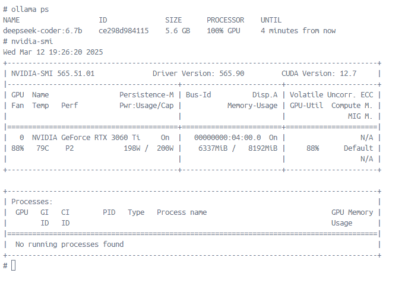

# llama-kattis

## Overview

This infrastructure has two containers: `jupyter` and `ollama`. 
- The `jupyter` container will launch a Jupyter server that is accessible through the 
host machine's browser at port 18888
- The `ollama` container can be launched using either `ollama` service (with GPU) or `ollama-cpu` service (without GPU). 

## Setup Docker containers

- First, clone the repository

~~~bash
git config --global core.autocrlf false
git clone https://github.com/linhbngo/ollama_platform
~~~

- Next, cd into the cloned repo and run the followings. 

~~~bash
cd ollama_platform
docker compose build --no-cache base
docker compose build --no-cache jupyter_ollama
~~~

## Confirm GPU availability for Windows

Inside your powershell terminal, run the followings. 

~~~bash
docker run --rm -it --gpus=all nvcr.io/nvidia/k8s/cuda-sample:nbody nbody -gpu -benchmark
~~~

You should expect to see your GPU card detected. 

~~~output
Run "nbody -benchmark [-numbodies=<numBodies>]" to measure performance.
        -fullscreen       (run n-body simulation in fullscreen mode)
        -fp64             (use double precision floating point values for simulation)
        -hostmem          (stores simulation data in host memory)
        -benchmark        (run benchmark to measure performance)
        -numbodies=<N>    (number of bodies (>= 1) to run in simulation)
        -device=<d>       (where d=0,1,2.... for the CUDA device to use)
        -numdevices=<i>   (where i=(number of CUDA devices > 0) to use for simulation)
        -compare          (compares simulation results running once on the default GPU and once on the CPU)
        -cpu              (run n-body simulation on the CPU)
        -tipsy=<file.bin> (load a tipsy model file for simulation)

NOTE: The CUDA Samples are not meant for performance measurements. Results may vary when GPU Boost is enabled.

> Windowed mode
> Simulation data stored in video memory
> Single precision floating point simulation
> 1 Devices used for simulation
GPU Device 0: "Ampere" with compute capability 8.6

> Compute 8.6 CUDA device: [NVIDIA GeForce RTX 3060 Ti]
38912 bodies, total time for 10 iterations: 33.305 ms
= 454.635 billion interactions per second
= 9092.707 single-precision GFLOP/s at 20 flops per interaction
~~~

## Launch containers

- First, launch the `jupyter` container

~~~bash
docker compose up -d jupyter_ollama
~~~

- If you are running on Windows with NVidia GPU, run the following:

~~~bash
# with GPU
docker compose up -d ollama
~~~

- As you run your ollama query, you will observe that your model is 100% loaded into 
GPU, and the GPU's memory is utilized. 

- If you are running on a Mac or a Windows without NVidia GPU, run the following:

~~~bash
# without GPU
docker compose up -d ollama-cpu
~~~

## Accessing the Jupyter server

